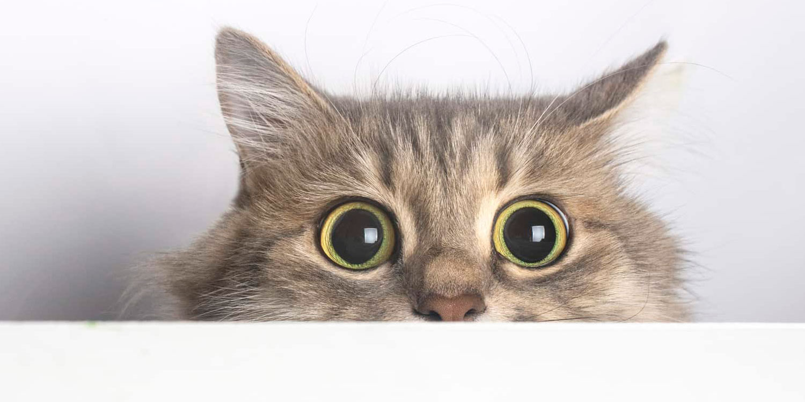

<!DOCTYPE html>
<html lang="pt-BR">
<head>
    <meta charset="UTF-8">
    <meta name="viewport" content="width=device-width, initial-scale=1.0">
    <link rel="stylesheet" href="teste.css">
    <link rel="preconnect" href="https://fonts.googleapis.com">
    <link rel="preconnect" href="https://fonts.gstatic.com" crossorigin>
    <link href="https://fonts.googleapis.com/css2?family=Alumni+Sans+Collegiate+One&display=swap" rel="stylesheet">
    <title>Teste</title>
</head>
<body>
    
    
Meu gato come <strong>casada</strong>

    <!--Info das casadas-->
        <h1>Casadas ja traçadas</h1>
            <ul>
                <li>Julia do 505</li>
                <li>Fernanda da dua 2</li>
                <li>Sabrina dona do salão</li>
                <li>Matheus mecanico</li>
            </ul>
        <h2>Casadas na fila</h2>
            <ul>
                <li>Tereza Pastora</li>
                <li>Laura da rua 3</li>
                <li>Lucas caixa do mercado</li>
                <li>Maria professora da creche</li>
            </ul>
        <h3>Casadas alvo</h3>
            <ul>
                <li>Ana do jeta preto</li>
                <li>Isadora do rua da torre</li>
                <li>Isabela Confeteira</li>
                <li>Eduarda da petshop</li>
            </ul>
            <button>Alterar usuario</button>
        
</body>
</html>
